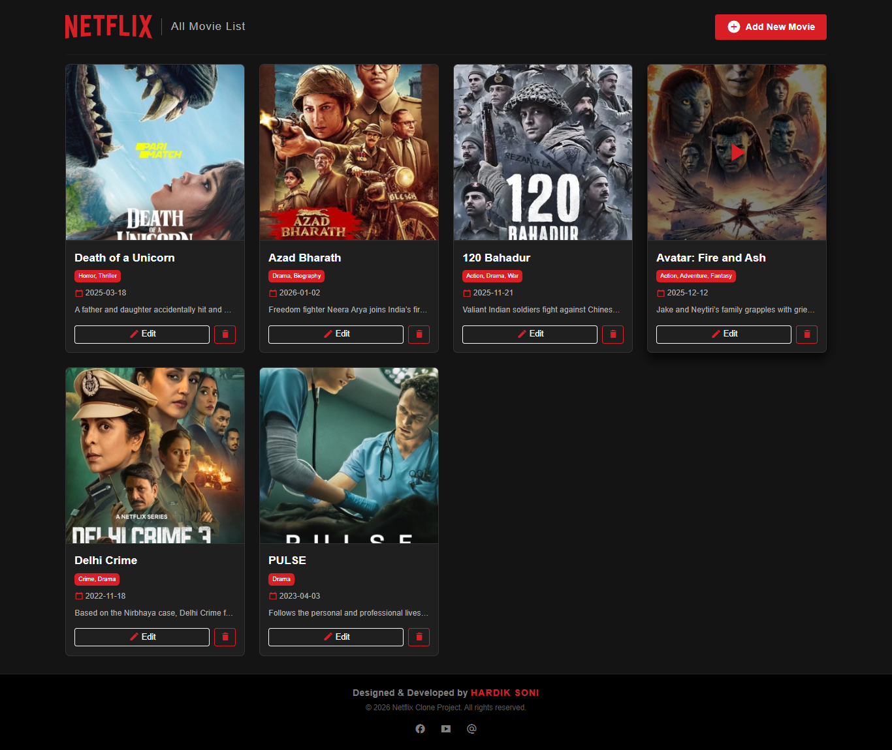
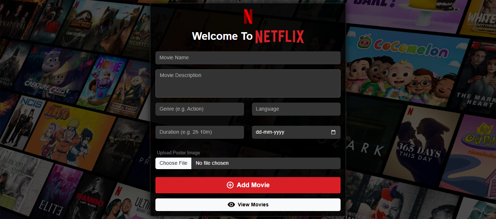
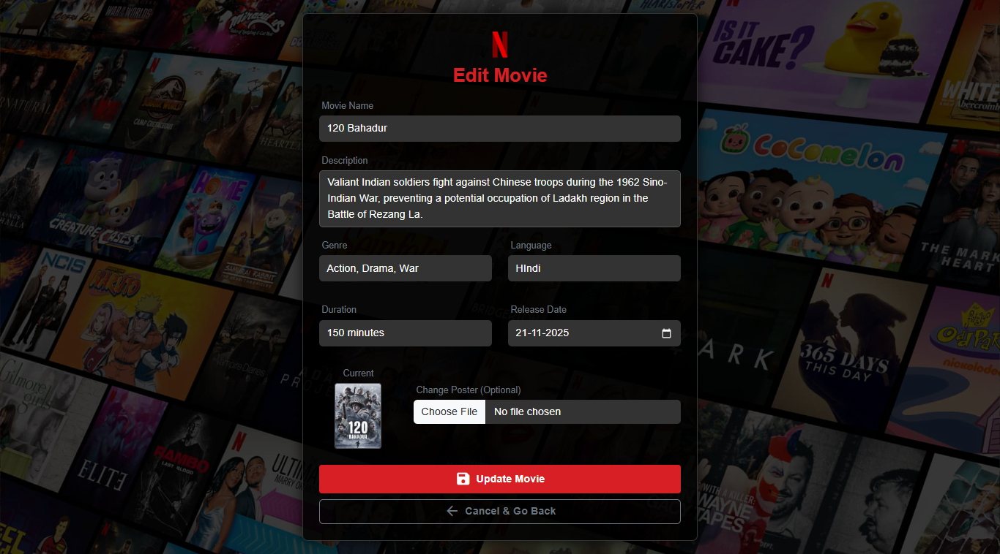

<div align="center">
  <br />
  <a href="https://github.com/HardikSoni1994/NETFIX-clone">
    
  </a>
  <h1>🎬 Netflix Clone - Manager Panel</h1>
  <p>
    <b>A Premium Full-Stack Movie Management Dashboard inspired by Netflix.</b>
  </p>
  <p>
    Built with MERN Stack principles (MongoDB, Express, Node.js) and EJS for templating.
  </p>

  <p>
    
    
    
  </p>
  <br />
</div>

---

## 📖 About The Project

This project is a dynamic, full-stack web application designed to manage a movie database with a UI styled after the iconic Netflix interface. It demonstrates a robust implementation of **CRUD operations** (Create, Read, Update, Delete) architecture.

### ✨ Key Features

| Feature | Description |
| :--- | :--- |
| **🔴 Premium Dark UI** | Custom CSS styling to replicate the authentic Netflix dark theme feel. |
| **🔄 Dynamic CRUD** | Seamlessly Add, Edit, and Delete movies directly from the database via the UI. |
| **📱 Responsive Design** | Works beautifully on desktops, tablets, and mobile devices. |
| **🗂️ MVC Architecture** | Clean code structure separating Models, Views, and Controllers. |
| **✨ Interactive Modals** | View movie details in smooth, scrollable pop-up modals without page reloads. |

---

## 🚀 Tech Stack

<div align="center">

| Backend | Database | Frontend | Tools |
| :---: | :---: | :---: | :---: |
|  <br>  |  |  <br>  <br>  |  <br>  |

</div>

---

## 📸 Project Screenshots

<div align="center">
  <h3>🏠 Home Page (Dashboard)</h3>
  
  <br/><br/>

  <h3>📝 Add Movie Form</h3>
  
  <br/><br/>

  <h3>🎬 Movie Details Modal</h3>
  
</div>

---

<details>
<summary><h2>📂 Folder Structure (Click to Expand)</h2></summary>
<br>

A clean **Model-View-Controller (MVC)** structure ensures code maintainability.

```text
NETFIX-clone/
├── 📂 config/          # Database connection configuration
├── 📂 controllers/     # Business logic (CRUD functions)
├── 📂 models/          # Mongoose database schemas
├── 📂 public/          # Static assets (CSS, client-side JS)
│   ├── 📂 images/
│   └── style.css
├── 📂 routes/          # Express API and view routes
├── 📂 screenshots/     # Project images for README
├── 📂 uploads/         # Directory for uploaded movie posters
├── 📂 views/           # EJS Frontend templates
│   ├── 📂 partials/    # Reusable headers/footers
│   └── ...ejs files
├── .gitignore          # Files ignored by Git
├── server.js           # Application entry point
└── package.json        # Project dependencies and scripts